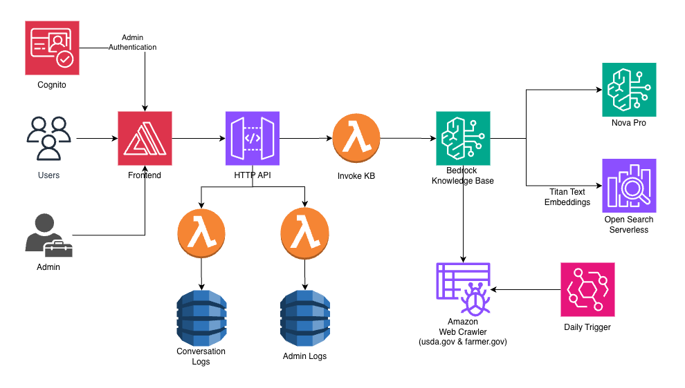

# Architecture Deep Dive

This document provides a detailed explanation of the AskUSDA architecture.

---

## Architecture Diagram



---

## Architecture Overview

AskUSDA is built on a fully serverless AWS architecture, designed for scalability, cost-efficiency, and ease of maintenance. The system consists of three main user flows:

1. **Visitor Chat Flow** – Users interact with the AI chatbot via a hover-over widget on the main page
2. **Admin Dashboard Flow** – Staff access metrics, conversation feedback, and escalation requests at `/admin`
3. **Knowledge Ingestion Flow** – USDA.gov and farmers.gov content is indexed via a web crawler data source

---

## Architecture Flow

### 1. User Interaction (Public, Farmers, Ranchers)

Users access the chatbot through a web interface hosted on **AWS Amplify**:

- The **Frontend** is a Next.js application (App Router) with a main page and hover-over chatbot
- The main page displays a USDA-themed background; the **ChatBot** component floats as a widget
- Users send messages over **WebSockets** and receive **streaming** responses with markdown and citations
- **Thumbs up / thumbs down** feedback is collected per assistant message and sent over the same WebSocket

### 2. WebSocket API (Chat) and HTTP API (Admin)

**Amazon API Gateway** provides two entry points:

- **WebSocket API** (`AskUSDA-WebSocket`):
  - Routes: `$connect`, `$disconnect`, `sendMessage`, `submitFeedback`, `submitEscalation`
  - All chat, feedback, and escalation traffic from the chatbot uses the WebSocket connection
  - Single Lambda (**WebSocket Handler**) handles every route

- **HTTP API** (`AskUSDA-AdminAPI`):
  - `GET /metrics` – Dashboard statistics (conversations, feedback, escalations) — **Cognito protected**
  - `GET /feedback`, `POST /feedback` – Conversation feedback list (protected) and submit (public)
  - `GET /escalations`, `POST /escalations`, `DELETE /escalations/{id}` – Escalation list/delete (protected), create (public)
  - CORS enabled; GET and DELETE routes use Cognito JWT authorizer

### 3. WebSocket Handler Lambda (Chat + Feedback + Escalation)

The **AskUSDA-WebSocketHandler** Lambda (`lambda/websocket-handler/index.js`) implements the core chat flow:

- **Connect / Disconnect**: Logs connection; no persistence of connectionId in DynamoDB
- **sendMessage**:  
  - Validates and filters input via **Bedrock Guardrail**  
  - Sends typing indicator  
  - Calls **Bedrock Knowledge Base** (**RetrieveAndGenerate**) for RAG and streaming reply (Nova Pro)  
  - Streams full response and citations to the client over WebSocket (no per-chunk streaming; single message)  
  - Returns `conversationId` and session data; conversation is **not** saved until feedback is submitted
- **submitFeedback**: Saves the conversation (question, answer, citations, feedback) to **Conversation History** keyed by `conversationId` and `timestamp`; feedback values are `pos` or `neg`
- **submitEscalation**: Writes escalation request (name, email, phone, question) to **Escalation Requests** table

### 4. Bedrock Knowledge Base

**Amazon Bedrock Knowledge Base** provides RAG:

- **Embedding model**: `amazon.titan-embed-text-v2:0` (1024 dimensions)
- **Generation model**: `amazon.nova-pro-v1:0` for streaming responses
- **Retrieve**: Fetches relevant chunks from the vector store for context
- **Optional Guardrail**: Content filtering on input and output; fail-open on errors
- Returns **citations** (source URLs) that the frontend renders with markdown

### 5. OpenSearch Serverless

**Amazon OpenSearch Serverless** is the vector store:

- **Vector collection**: `askusda-vectors`  
- **Index**: `askusda-index` with `vector` field, L2 distance, 1024-d vectors
- Mappings include `AMAZON_BEDROCK_TEXT_CHUNK` and `AMAZON_BEDROCK_METADATA` for Knowledge Base compatibility
- Scales automatically; no cluster management

### 6. Data Sources (Knowledge Base)

The Knowledge Base is populated via a **web crawler** data source:

- **Seed URLs**: `https://www.usda.gov/`, `https://www.farmers.gov/`
- **Scope**: `HOST_ONLY`; configurable rate limit
- Content is parsed, embedded with Titan, and stored in OpenSearch Serverless
- Sync can be triggered manually or via EventBridge (daily at 6:00 AM UTC in current CDK via AskUSDA-DailyKBSync rule)

### 7. Admin Flow

Admins use the **`/admin`** dashboard:

1. Frontend calls **Admin HTTP API** with Cognito JWT: `GET /metrics`, `GET /feedback`, `GET /escalations`; and **DELETE** `/escalations/{id}`. Public (no auth): `POST /feedback`, `POST /escalations`.
2. **AskUSDA-AdminHandler** Lambda (`lambda/admin-api/index.js`) implements each route.
3. **Metrics**: Aggregated from **Conversation History** (by date index and scan for feedback/responseTimeMs) and **Escalation Requests** (count).
4. **Feedback**: Queries **Conversation History** via `feedback-timestamp-index` (conversations with feedback); returns list with conversationId, question, answerPreview, feedback, timestamp, etc.
5. **Escalations**: List (GET), create (POST from chatbot or form), delete (DELETE by escalationId). Table keyed by `escalationId` and `timestamp`.

*Cognito is integrated: GET and DELETE admin routes use a JWT authorizer; POST /feedback and POST /escalations are public for the chatbot and escalation form.*

### 8. Data Storage (DynamoDB)

Two DynamoDB tables store application data:

#### Conversation History (`AskUSDA-ConversationHistory`)

- **Keys**: `conversationId` (PK), `timestamp` (SK)
- **GSIs**: `sessionId-timestamp-index`, `date-timestamp-index`, `feedback-timestamp-index`
- **TTL**: `ttl` for automatic expiry (e.g. 90 days)
- Stores: one record per Q&A when feedback is submitted — `conversationId`, `sessionId`, `question`, `answer`, `answerPreview`, `citations`, `responseTimeMs`, `date`, `feedback` (`pos`/`neg`), `feedbackTs`
- Used for metrics, feedback list, and admin dashboard views

#### Escalation Requests (`AskUSDA-EscalationRequests`)

- **Keys**: `escalationId` (PK), `timestamp` (SK)
- **GSI**: `DateTimestampIndex` on `date` + `timestamp`
- **TTL**: `ttl` for optional expiry (e.g. 1 year)
- Stores: `name`, `email`, `phone`, `question`, `sessionId`, `status`, `date`
- Used by WebSocket (submitEscalation) and Admin API (list, delete)

---

## Cloud Services / Technology Stack

### Frontend

- **Next.js 16**: React framework with App Router
  - Main page: full-screen background image + hover-over **ChatBot**
  - **`/admin`**: Dashboard with metrics, feedback table, escalation table, modals
  - **Tailwind CSS v4** and **@tailwindcss/typography** for layout and markdown
  - **react-markdown** for rendering bot responses and admin conversation previews
  - Client-side **WebSocket** for chat; **fetch** for Admin API

- **AWS Amplify**: Frontend hosting and CI/CD
  - Builds from `frontend/` (e.g. `npm ci` + `npm run build`)
  - Env: `NEXT_PUBLIC_WEBSOCKET_URL`, `NEXT_PUBLIC_ADMIN_API_URL` from CDK outputs

### Backend Infrastructure

- **AWS CDK**: Infrastructure as Code (TypeScript)
  - Single stack defines DynamoDB, OpenSearch, Bedrock KB, Lambdas, API Gateways, Amplify app

- **Amazon API Gateway**:
  - **WebSocket API** for chat and feedback
  - **HTTP API** for admin (CORS, no authorizer in current setup)

- **AWS Lambda** (Node.js 20.x):
  - **AskUSDA-WebSocketHandler** (`lambda/websocket-handler/index.js`): WebSocket routes (sendMessage, submitFeedback, submitEscalation), Knowledge Base RetrieveAndGenerate, guardrails, DynamoDB
  - **AskUSDA-AdminHandler** (`lambda/admin-api/index.js`): HTTP handlers for metrics, feedback, escalations

### AI/ML Services

- **Amazon Bedrock**:
  - Knowledge Base with RAG over USDA/farmers.gov content
  - **Nova Pro** (`amazon.nova-pro-v1:0`) for generation
  - **Titan Embed Text v2** for embeddings
  - **Guardrail** (`AskUSDA-Guardrail`) for content filtering

- **Amazon OpenSearch Serverless**: Vector store (see above)

### Data Storage

- **Amazon DynamoDB**:
  - **Conversation History**: Chat feedback records, metrics, session data
  - **Escalation Requests**: Admin-managed escalation records
  - Pay-per-request billing; TTL where used

### Security & Authentication

- **IAM**: Least-privilege roles for Lambdas (DynamoDB, Bedrock, Knowledge Base, OpenSearch, Execute API)
- **Cognito**: Admin User Pool (`AskUSDA-AdminPool`) with JWT authorizer on GET /metrics, GET /feedback, GET /escalations, DELETE /escalations/{id}. POST /feedback and POST /escalations are public.
- **Secrets Manager**: Used for Amplify GitHub token (`usda-token`), not for app runtime secrets.

---

## Infrastructure as Code

This project uses **AWS CDK** to define and deploy infrastructure.

### CDK Stack Structure

```
backend/
├── bin/
│   └── backend.ts              # CDK app entry point
├── lib/
│   └── backend-stack.ts        # Main stack definition
├── lambda/
│   ├── websocket-handler/
│   │   ├── index.js            # WebSocket handler (chat, feedback, escalation)
│   │   └── package.json
│   └── admin-api/
│       ├── index.js            # Admin HTTP API handler
│       └── package.json
├── cdk.json
├── package.json
└── tsconfig.json
```

### Key CDK Constructs

1. **DynamoDB Table** (`aws-cdk-lib/aws-dynamodb`)
   - `ConversationLogs` and `EscalationRequests` with GSIs and TTL

2. **VectorCollection** (`@cdklabs/generative-ai-cdk-constructs`)
   - OpenSearch Serverless collection `askusda-vectors`

3. **VectorIndex** (`@cdklabs/generative-ai-cdk-constructs`)
   - Index `askusda-index` with vector and metadata mappings

4. **CfnKnowledgeBase** (`aws-cdk-lib/aws-bedrock`)
   - Bedrock Knowledge Base with Titan embeddings and OpenSearch storage

5. **CfnDataSource** (`aws-cdk-lib/aws-bedrock`)
   - Web crawler data source for usda.gov and farmers.gov

6. **CfnGuardrail** (`aws-cdk-lib/aws-bedrock`)
   - Content filters for input/output

7. **WebSocketApi** / **WebSocketStage** (`aws-cdk-lib/aws-apigatewayv2`)
   - WebSocket API with connect, disconnect, sendMessage, submitFeedback, submitEscalation routes

8. **HttpApi** (`aws-cdk-lib/aws-apigatewayv2`)
   - Admin HTTP API with /metrics, /feedback, /escalations, /escalations/{id}; JWT authorizer on GET/DELETE

9. **Function** (`aws-cdk-lib/aws-lambda`)
   - WebSocket and Admin Lambdas pointing at `lambda/websocket-handler` and `lambda/admin-api`

10. **CfnApp** / **CfnBranch** (`aws-cdk-lib/aws-amplify`)
    - Amplify app and branch with build spec and env vars

### Deployment Automation

- **Amplify**: Builds and deploys frontend on git push; uses CDK outputs for WebSocket and Admin API URLs.
- **CDK**: Deploy via `cdk deploy` (or your chosen CI); stack creates all backend resources.

---

## Security Considerations

### Authentication

- **Admin Dashboard**: GET and DELETE admin routes require Cognito JWT (Authorization header). POST /feedback and POST /escalations are public.
- **Chat / Feedback / Escalation**: No user auth; identified by WebSocket `connectionId` only.

### Authorization

- **IAM**: Lambda roles scoped to required services (DynamoDB, Bedrock, OpenSearch, API Gateway).
- **API Gateway**: No authorizers; WebSocket and Admin APIs are publicly reachable.

### Data Encryption

- **At rest**: DynamoDB and OpenSearch Serverless use default encryption.
- **In transit**: HTTPS/WSS for all client traffic.

### Network Security

- **CORS**: Admin API allows configured origins.
- **OpenSearch Serverless**: Data plane access via IAM; no VPC required for this setup.

### Data Privacy

- **Conversation History**: Stores Q&A with feedback for analytics and admin views; consider PII and retention policy.
- **Escalation Requests**: Include name, email, phone, question; handle per USDA privacy requirements.

---

## Scalability

### Auto-scaling

- **Lambda**: Concurrency scales automatically with demand.
- **DynamoDB**: Pay-per-request; no provisioned capacity.
- **OpenSearch Serverless**: Managed scaling.
- **API Gateway**: Managed scaling for WebSocket and HTTP APIs.

### Performance Optimizations

- **Streaming**: Chat responses streamed over WebSocket to reduce perceived latency.
- **Projections / Filters**: Admin Lambda uses GSIs (date, feedback) and projections to limit DynamoDB reads.
- **Feedback**: Admin lists conversations with feedback via `feedback-timestamp-index`; no separate “get by conversationId” endpoint in current implementation.

### Cost Optimization

- **Serverless**: Pay for actual usage.
- **DynamoDB on-demand**: No provisioned RCU/WCU.
- **OpenSearch Serverless**: No cluster management; standby replicas disabled in stack.

---

## Data Flow Diagrams

### Chat Request Flow

```
User → Amplify (Frontend) → WebSocket API → WebSocket Handler Lambda
                                                      ↓
                                              Guardrail (input)
                                                      ↓
                                              Bedrock Knowledge Base (RetrieveAndGenerate)
                                                      ↓
                                              OpenSearch Serverless (vector search) + Nova Pro
                                                      ↓
                                              sendMessage response (answer, citations, conversationId) → User
                                                      ↓
                                              (Conversation saved to DynamoDB only when user submits feedback via submitFeedback)
```

### Feedback Flow

```
User (thumbs up/down) → WebSocket (submitFeedback) → WebSocket Handler Lambda
                                                              ↓
                                                    Save feedback + conversation → DynamoDB (Conversation History)
                                                              ↓
                                                    feedbackReceived → User
```

### Admin Dashboard Flow

```
Admin → Amplify (/admin) → HTTP API (GET /metrics, /feedback, /escalations)
                                    ↓
                          Admin Handler Lambda
                                    ↓
                          DynamoDB (Conversation History, Escalation Requests)
                                    ↓
                          JSON response → Admin (metrics, tables, modals)
```

### Knowledge Ingestion Flow

```
Web Crawler Data Source (usda.gov, farmers.gov)
                    ↓
         Bedrock Data Source ingest
                    ↓
         Chunking + Titan Embeddings
                    ↓
         OpenSearch Serverless (vector index)
```

---

## Related Documentation

- [Deployment Guide](./deploymentGuide.md) – How to deploy the application
- [API Documentation](./APIDoc.md) – WebSocket and Admin API reference
- [Modification Guide](./modificationGuide.md) – How to customize the application
- [User Guide](./userGuide.md) – How to use the chatbot and admin dashboard
